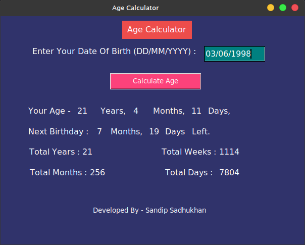

# Advanced Age Calculator
It is a advanced age calculator tool developed by [sandip Sadhukhan](https://yourwebsite.github.io/) with **python**.

## Requirement
* python 3
## Download the Tool
go to your terminal or Command Prompt and write the following commands
```bash
git clone https://github.com/sandipsadhukhan/ageCalculator.git
```
## Run the Tool
### On Mac os/Linux
```bash
cd ageCalculator
python3 ageCalculator.py
```
### On Windows
```bash
cd currencyConverter
python currencyConverter.py
```
## Screenshot


## How to Use
1. Enter your Date Of Birth in **dd/mm/yyyy** format
1. Then, Click on *Calculate Age* Button. The program calculate your age with details information.

## Feature
* [x] Calculate your Full Age with years, months, days format.
* [x] Calculate Your Next Birthday is how months and days left.
* [x] Can Calculate Total years, months, weeks, days seperately.

---
### Contact with Developer
Email : sandip.sendme@gmail.com

---
### Sponsors
<a href="https://youtube.com/c/bongtuts"></a>